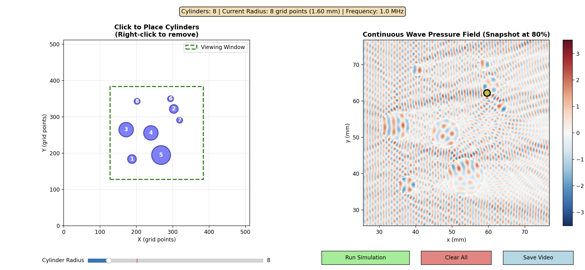
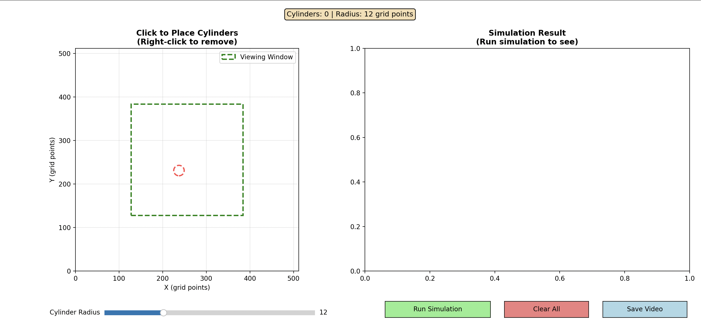
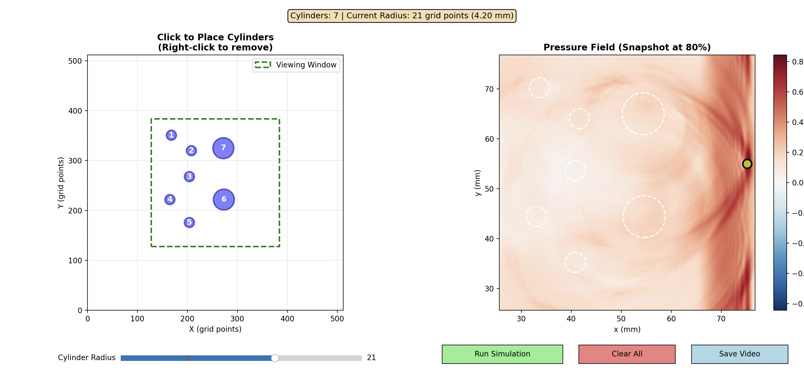

# JWave_Test

Small J-Wave Acoustic Wave Propagation Test with 3 cylinders, more to come....

# Acoustic Continuous Waves

## Interactive Demo for acoustic continuous wave propagation with cylinders:

https://github.com/user-attachments/assets/db5162c6-249c-44d7-9078-3ba325fe93f6

#### Interactive GUI 2nd Step

https://github.com/user-attachments/assets/f696cf68-d3f9-47a9-9684-da3b96fcb36d

Time for simulation: 72.61s

### Configuration 1

https://github.com/user-attachments/assets/cb2b8fc8-1f68-4a2f-9e14-ea0e4c764205

### Configuration 2

https://github.com/user-attachments/assets/260cb564-3a04-4d4a-9cda-11ebee41d30b

### Configuration 3

https://github.com/user-attachments/assets/973237ad-80ae-43ae-9e2e-0362501b09a4

### Configuration 4

https://github.com/user-attachments/assets/522ecbea-9a7f-40b1-93dd-916099c65aed

### Configuration 5

https://github.com/user-attachments/assets/c3edac4d-a04b-4e87-9f66-5892b1d6b64b

---
# Acoustic Single Pulse Wave
---

## Interactive Demo for acoustic wave propagation with cylinders:

https://github.com/user-attachments/assets/1ad4e7c7-2722-40ae-83f9-c5bdef66e5e8

#### Interactive GUI 1st Step

#### Interactive GUI 2nd Step

---

## Cylinder Configurations with a single acoustic pulse

### Configuration 1

https://github.com/user-attachments/assets/08cd1c64-da08-42d0-b8c9-e93b22a6e0e9

### Configuration 2

https://github.com/user-attachments/assets/f6b863d1-cbdf-44d2-aa40-3fbcc0c476ea

### Configuration 3

https://github.com/user-attachments/assets/359d48fc-9894-41f0-9ac4-809f0e1352e2

### Configuration 4

https://github.com/user-attachments/assets/4fc57d99-b679-4cac-92f1-8ad60d2c6a3a

### Configuration 5

https://github.com/user-attachments/assets/d1cf4399-b0fc-494b-b9d5-043a74a6a75b

## Cylinder Configurations with a single acoustic pulse showing the max pressure point

### Configuration 1

https://github.com/user-attachments/assets/2aa2aa0f-edff-414a-8947-f677d09c932b

### Configuration 2

https://github.com/user-attachments/assets/e393404c-8468-4049-8c84-b6673cc5d05a

### Configuration 3

https://github.com/user-attachments/assets/99be7b8f-91e4-4508-ae8c-b1be66c30a2e

### Configuration 4

https://github.com/user-attachments/assets/3b7e7a61-58a9-4f23-a510-094482ff12ef

### Configuration 5

https://github.com/user-attachments/assets/ddada8ce-41b6-4a02-b351-a37668de792a

## Cylinder Configurations of varying radii with a single acoustic pulse 

### Configuration 1

https://github.com/user-attachments/assets/64809fcb-eb7b-4063-9d31-d5403f2e4ba0

### Configuration 2

https://github.com/user-attachments/assets/f688ac15-e7fe-4e2d-b822-ce4a0b596391

### Configuration 3

https://github.com/user-attachments/assets/abff3ccf-998e-4283-ac32-05ce4df10f58

### Configuration 4

https://github.com/user-attachments/assets/aed9c9f1-1715-43ed-be05-76adda12d6e0

### Configuration 5

https://github.com/user-attachments/assets/2be62b58-726f-47e9-bbf0-18a8da8facd5

